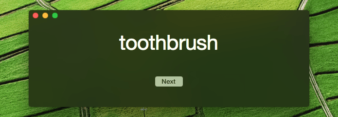

# Random Word
Basic OS X App that displays a random word from a list, written in Swift.

## Functionality
Very basic: the app will grab a random entry from a given word list and display it. 

You can advance to the next word by clicking “Next” or by pressing `Return`.

The displayed word can be copied to the clipboard.

## Technologies

- NSVisualEffectView
- Auto Layout
- Dictionary Services (currently not implemented)

### Acknowledgements

The word file included is Desi Quintan’s [Great Noun List](http://www.desiquintans.com/nounlist). 

This file only has nouns in the English language in it.
